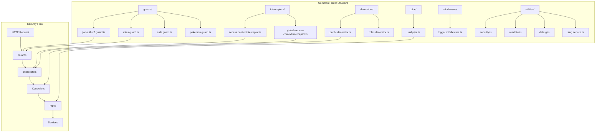

# Knox Pro Common Folder - Shared Security & Utility Components

## Executive Summary

The `common` folder in Knox Pro contains the foundational security infrastructure, shared utilities, and cross-cutting concerns that support the entire application architecture. This includes guards, interceptors, decorators, pipes, middleware, and utility functions that provide enterprise-grade security, validation, and operational capabilities across all modules.

## 🏗️ Common Folder Architecture Overview



## 1. 🛡️ Security Guards (`guards/`)

### 1.1 JWT Authentication Guard (`jwt-auth.v2.guard.ts`)

The enhanced JWT authentication guard provides sophisticated route-based access control with whitelist/blacklist functionality.

```typescript
@Injectable()
export class JwtAuthGuard extends AuthGuard('jwt') {
    constructor(private reflector: Reflector) {
        super();
    }

    canActivate(context: ExecutionContext) {
        const req = context.switchToHttp().getRequest();
        const { method, route, url } = req;
        const requestMethod = method?.toUpperCase();
        const requestPath = route?.path || url;

        console.log(`[JwtAuthGuard] Checking: ${requestMethod} ${requestPath}`);

        // Step 1: Check blacklisted routes (always require JWT)
        const isBlacklisted = ROUTE_ACCESS_CONFIG.blacklist.some(
            (item) => item.method === requestMethod && requestPath === item.path,
        );

        if (isBlacklisted) {
            console.log(`[JwtAuthGuard] Blacklisted: ${requestMethod} ${requestPath} - JWT Required`);
            return super.canActivate(context);
        }

        // Step 2: Check whitelisted routes (public access)
        const isWhitelisted = ROUTE_ACCESS_CONFIG.whitelist.some(
            (item) => item.method === requestMethod && requestPath === item.path,
        );

        if (isWhitelisted) {
            console.log(`[JwtAuthGuard] Whitelisted: ${requestMethod} ${requestPath} - Access Granted`);
            return true; // Allow access without JWT
        }

        // Step 3: Check @Public() decorator
        const isPublic = this.reflector.getAllAndOverride<boolean>(IS_PUBLIC_KEY, [
            context.getHandler(),
            context.getClass(),
        ]);

        if (isPublic) {
            console.log(`[JwtAuthGuard] Public decorator: ${requestMethod} ${requestPath} - Access Granted`);
            return true;
        }

        // Step 4: Default - require JWT authentication
        console.log(`[JwtAuthGuard] Protected: ${requestMethod} ${requestPath} - JWT Required`);
        return super.canActivate(context);
    }

    handleRequest(err, user, info, context: ExecutionContext) {
        const req = context.switchToHttp().getRequest();
        const { method, route, url } = req;
        const requestPath = route?.path || url;

        if (err) {
            console.error(`[JwtAuthGuard] Auth Error on ${method} ${requestPath}:`, err.message);
            throw err;
        }

        if (!user) {
            console.error(`[JwtAuthGuard] No user found for ${method} ${requestPath}:`, info?.message || 'Unknown error');
            throw new UnauthorizedException({
                message: 'Authentication required',
                error: 'Unauthorized',
                statusCode: 401,
                timestamp: new Date().toISOString(),
                path: requestPath,
                details: info?.message || 'Invalid or missing authentication token'
            });
        }

        // Enhanced user context for downstream use
        user.requestPath = requestPath;
        user.requestMethod = method;
        user.authenticatedAt = new Date().toISOString();

        console.log(`[JwtAuthGuard] Auth Success: ${method} ${requestPath} - User: ${user.id} (${user.email})`);

        return user;
    }

    getRequest(context: ExecutionContext) {
        return context.switchToHttp().getRequest();
    }
}

// Route Access Configuration
export const ROUTE_ACCESS_CONFIG = {
    whitelist: [
        // Authentication endpoints
        { method: 'POST', path: '/auth/login' },
        { method: 'POST', path: '/auth/register' },
        { method: 'POST', path: '/auth/signin' },
        { method: 'POST', path: '/auth/login-legacy' },
        
        // Public API endpoints
        { method: 'GET', path: '/api' },
        { method: 'GET', path: '/api/public-key' },
        
        // Health and monitoring
        { method: 'GET', path: '/health' },
        { method: 'GET', path: '/status' },
        
        // Documentation
        { method: 'GET', path: '/docs' },
        { method: 'GET', path: '/api-docs' },
    ],
    blacklist: [
        // Administrative endpoints
        { method: 'GET', path: '/admin' },
        { method: 'POST', path: '/admin/create' },
        { method: 'PUT', path: '/admin' },
        { method: 'DELETE', path: '/admin' },
        
        // Sensitive operations
        { method: 'DELETE', path: '/api/users' },
        { method: 'DELETE', path: '/api/workspaces' },
    ],
};
```

### 1.2 Role-Based Access Guard (`roles.guard.ts`)

Implements fine-grained role-based access control using AccessControl library.

```typescript
@Injectable()
export class RolesGuard implements CanActivate {
    constructor(private readonly reflector: Reflector) {}

    async canActivate(context: ExecutionContext): Promise<boolean> {
        // Get required roles from decorator
        const roles = this.reflector.get<string[]>('roles', context.getHandler());
        
        if (!roles) {
            return true; // No role restriction
        }

        const req = context.switchToHttp().getRequest();
        const { user } = req;

        if (!user) {
            throw new UnauthorizedException('User not authenticated');
        }

        // Load access control configuration
        const accessFile = await readFile('mocks/public-paths.json');
        const accessControl = new AccessControl(JSON.parse(accessFile));

        // Validate user role permissions
        const hasAccess = roles.some(role => {
            const permission = accessControl.can(user.role).readAny('resource');
            return permission.granted;
        });

        if (!hasAccess) {
            console.error(`[RolesGuard] Access denied for user ${user.id} with role ${user.role}. Required: ${roles.join(', ')}`);
            throw new ForbiddenException(`Insufficient role permissions. Required: ${roles.join(', ')}`);
        }

        console.log(`[RolesGuard] Access granted for user ${user.id} with role ${user.role}`);
        return true;
    }
}
```

### 1.3 Custom Authentication Guard (`auth.guard.ts`)

Provides manual JWT validation with enhanced security features.

```typescript
@Injectable()
export class AuthGuard implements CanActivate {
    constructor(
        private jwtService: JwtService,
        private reflector: Reflector,
    ) {}

    async canActivate(context: ExecutionContext): Promise<boolean> {
        console.log('[AuthGuard] canActivate');

        // Check for @Public() decorator
        const isPublic = this.reflector.getAllAndOverride<boolean>(IS_PUBLIC_KEY, [
            context.getHandler(),
            context.getClass(),
        ]);
        
        if (isPublic) {
            return true;
        }

        const request = context.switchToHttp().getRequest();
        const token = this.extractTokenFromHeader(request);
        
        if (!token) {
            throw new UnauthorizedException('No authentication token provided');
        }

        try {
            const payload = await this.jwtService.verifyAsync(token, {
                secret: jwtConstants.secret,
            });
            
            // Enhanced security validations
            if (this.isTokenExpired(payload)) {
                throw new UnauthorizedException('Token has expired');
            }

            if (this.isTokenRevoked(payload)) {
                throw new UnauthorizedException('Token has been revoked');
            }

            // Add comprehensive user context
            request['user'] = {
                ...payload,
                tokenValidatedAt: new Date().toISOString(),
                securityContext: {
                    tokenSource: 'manual_validation',
                    ipAddress: request.ip,
                    userAgent: request.headers['user-agent']
                }
            };

            console.log('[AuthGuard] Token validated successfully for user:', payload.username);
        } catch (error) {
            console.error('[AuthGuard] Token validation failed:', error.message);
            throw new UnauthorizedException('Invalid or expired token');
        }
        
        return true;
    }

    private extractTokenFromHeader(request: Request): string | undefined {
        const [type, token] = request.headers.authorization?.split(' ') ?? [];
        return type === 'Bearer' ? token : undefined;
    }

    private isTokenExpired(payload: any): boolean {
        return payload.exp && Date.now() >= payload.exp * 1000;
    }

    private isTokenRevoked(payload: any): boolean {
        // TODO: Implement token blacklist checking
        // This would query a Redis cache or database for revoked tokens
        return false;
    }
}
```

### 1.4 Specialized Guards

```typescript
// Pokemon Guard - Example of domain-specific guard
@Injectable()
export class PokemonGuard implements CanActivate {
    canActivate(context: ExecutionContext): boolean {
        const request = context.switchToHttp().getRequest();
        const { user } = request;
        
        // Custom business logic validation
        return user?.preferences?.pokemon === true;
    }
}
```

## 2. 🔧 Interceptors (`interceptors/`)

### 2.1 Access Control Interceptor (`access.control.interceptor.ts`)

Handles request/response encryption and access control validation.

```typescript
@Injectable()
export class AccessControlInterceptor implements NestInterceptor {
    constructor(
        private readonly reflector: Reflector,
        private readonly rsaService: RsaService,
        private readonly securityAESService: SecurityAESService
    ) { }

    async intercept(context: ExecutionContext, next: CallHandler): Promise<Observable<any>> {
        const req = context.switchToHttp().getRequest();
        
        console.log('[AccessControlInterceptor] Processing request to:', req.route?.path);

        // Define encryption-exempt routes
        const whitelist = [
            '/api/public-key',
            '/api/auth/login',
            '/api/auth/register',
            '/api',
            '/api/upload/:resource',
            '/api/security/decrypt',
            '/api/security/encrypt', 
            '/api/security/init',
            '/api/aes/encrypt',
            '/api/aes/decrypt',
            '/api/aes/init'
        ];

        if (whitelist.includes(req.route?.path)) {
            console.log('[AccessControlInterceptor] Route whitelisted, skipping encryption');
            return next.handle();
        }

        const { user = {} } = req;

        // Handle encrypted request bodies
        if (req.body?.encryptedData && user.username) {
            try {
                console.log('[AccessControlInterceptor] Decrypting request body');
                
                const decryptedData = await this.securityAESService.decrypt(
                    req.body.encryptedData,
                    req.body.encryptedKey,
                    req.body.iv,
                    req.body.authTag,
                    user.username
                );
                
                // Replace encrypted payload with decrypted data
                req.body = decryptedData;
                
                console.log('[AccessControlInterceptor] Request successfully decrypted');
            } catch (error) {
                console.error('[AccessControlInterceptor] Request decryption failed:', error);
                throw new ForbiddenException('Invalid encrypted request payload');
            }
        }

        return next.handle().pipe(
            map(async (response) => {
                // Optionally encrypt sensitive responses
                if (this.shouldEncryptResponse(req.route?.path, response, user)) {
                    console.log('[AccessControlInterceptor] Encrypting response');
                    return await this.securityAESService.encrypt(response, user.username);
                }
                return response;
            })
        );
    }

    private shouldEncryptResponse(path: string, response: any, user: any): boolean {
        // Define sensitive endpoints requiring response encryption
        const sensitiveEndpoints = [
            '/api/users/profile',
            '/api/financial-data',
            '/api/medical-records',
            '/api/sensitive-documents',
            '/api/personal-information'
        ];
        
        // Check if response contains sensitive data
        const hasSensitiveData = response && (
            response.ssn || 
            response.medicalHistory || 
            response.financialData ||
            response.personalIdentifiableInformation
        );
        
        const shouldEncrypt = sensitiveEndpoints.some(endpoint => 
            path?.includes(endpoint)
        ) || hasSensitiveData;
        
        if (shouldEncrypt) {
            console.log(`[AccessControlInterceptor] Response encryption required for: ${path}`);
        }
        
        return shouldEncrypt;
    }
}
```

### 2.2 Global Access Context Interceptor (`global-access-context.interceptor.ts`)

Adds comprehensive access context to requests for enhanced authorization.

```typescript
@Injectable()
export class GlobalAccessContextInterceptor implements NestInterceptor {
    constructor(private readonly pulseAccessService: PulseAccessService) { }

    async intercept(context: ExecutionContext, next: CallHandler): Promise<Observable<any>> {
        const request = context.switchToHttp().getRequest();
        const response = context.switchToHttp().getResponse();
        
        console.log('[GlobalAccessContextInterceptor] Adding access context for:', request.path);

        // Add comprehensive access context to authenticated requests
        if (request.user) {
            await this.addAccessContext(request);
        }

        return next.handle().pipe(
            tap(() => {
                // Add access context to response headers
                if (request.user) {
                    response.set('X-User-Workspace', request.user.workspaceId);
                    response.set('X-User-Role', request.user.role);
                    response.set('X-Access-Context-Added', 'true');
                }
            }),
            map(responseData => {
                // Optionally modify response based on access context
                if (request.accessContext) {
                    return {
                        ...responseData,
                        meta: {
                            ...responseData.meta,
                            accessContext: {
                                totalAccessibleResources: request.accessContext.totalAccessibleCount,
                                resourceType: request.accessContext.resourceType
                            }
                        }
                    };
                }
                return responseData;
            })
        );
    }

    /**
     * Add comprehensive access context to the request
     */
    private async addAccessContext(request: any): Promise<void> {
        const { user } = request;
        const resourceType = this.extractResourceType(request);
        
        try {
            if (resourceType && resourceType !== 'unknown') {
                console.log(`[GlobalAccessContextInterceptor] Building access context for resource type: ${resourceType}`);
                
                // Get user's accessible resource IDs
                const accessibleResourceIds = await this.getUserAccessibleResourceIds(
                    user.id, 
                    user.workspaceId, 
                    resourceType
                );
                
                // Add comprehensive access context
                request.accessContext = {
                    resourceType,
                    accessibleResourceIds,
                    totalAccessibleCount: accessibleResourceIds.length,
                    userRole: user.role,
                    workspaceId: user.workspaceId,
                    contextGeneratedAt: new Date().toISOString(),
                    requestPath: request.path,
                    requestMethod: request.method
                };
                
                console.log(`[GlobalAccessContextInterceptor] Access context added: ${accessibleResourceIds.length} accessible ${resourceType} resources`);
            }
        } catch (error) {
            console.error('[GlobalAccessContextInterceptor] Failed to add access context:', error);
            // Continue without context rather than failing the request
            request.accessContext = {
                error: 'Failed to generate access context',
                timestamp: new Date().toISOString()
            };
        }
    }

    /**
     * Get specific resource IDs that the user can access
     */
    private async getUserAccessibleResourceIds(
        userId: string,
        workspaceId: string,
        resourceType: string
    ): Promise<string[]> {
        try {
            // Use Pulse service to get all grants for the user
            const grants = await this.pulseAccessService.getUserGrants(userId, workspaceId);
            
            // Filter grants by resource type and extract resource IDs
            const accessibleIds = grants
                .filter(grant => grant.resourceType === resourceType)
                .map(grant => grant.resourceId)
                .filter(id => id !== '*'); // Exclude wildcard grants
            
            return [...new Set(accessibleIds)]; // Remove duplicates
        } catch (error) {
            console.error(`[GlobalAccessContextInterceptor] Error getting accessible resource IDs:`, error);
            return [];
        }
    }

    /**
     * Extract resource type from request URL
     */
    private extractResourceType(request: any): string {
        const path = request.path || request.url || '';
        const pathParts = path.split('/').filter(Boolean);
        
        // Look for API resource pattern: /api/{resourceType}
        const apiIndex = pathParts.indexOf('api');
        if (apiIndex !== -1 && pathParts.length > apiIndex + 1) {
            const resourceType = pathParts[apiIndex + 1];
            
            // Map common resource types
            const resourceMapping = {
                'users': 'user',
                'documents': 'document',
                'policies': 'policy',
                'claims': 'claim',
                'workflows': 'workflow',
                'tasks': 'task'
            };
            
            return resourceMapping[resourceType] || resourceType;
        }
        
        return 'unknown';
    }
}
```

## 3. 🎯 Decorators (`decorators/`)

### 3.1 Public Decorator (`public.decorator.ts`)

Marks endpoints as publicly accessible, bypassing authentication.

```typescript
import { SetMetadata } from '@nestjs/common';

export const IS_PUBLIC_KEY = 'isPublic';

/**
 * Public decorator - marks endpoints as publicly accessible
 * 
 * Usage:
 * @Public()
 * @Get('health')
 * async healthCheck() {
 *   return { status: 'ok', timestamp: new Date() };
 * }
 */
export const Public = () => SetMetadata(IS_PUBLIC_KEY, true);
```

### 3.2 Roles Decorator (`roles.decorator.ts`)

Defines required roles for endpoint access.

```typescript
import { SetMetadata } from '@nestjs/common';

export const ROLES_KEY = 'roles';

/**
 * Roles decorator - defines required roles for endpoint access
 * 
 * Usage:
 * @Roles('admin', 'manager')
 * @Get('sensitive-data')
 * async getSensitiveData() {
 *   return { data: 'restricted information' };
 * }
 */
export const Roles = (...roles: string[]) => SetMetadata(ROLES_KEY, roles);

/**
 * Insurance-specific role decorators
 */
export const RequireUnderwriter = () => Roles('underwriter', 'senior_underwriter');
export const RequireClaimsAccess = () => Roles('claims_adjuster', 'claims_manager');
export const RequireAdminAccess = () => Roles('admin', 'system_administrator');
export const RequireManagerAccess = () => Roles('manager', 'senior_manager', 'director');
```

## 4. 🔧 Pipes (`pipe/`)

### 4.1 UUID Validation Pipe (`uuid.pipe.ts`)

Validates and sanitizes UUID parameters across the application.

```typescript
import { PipeTransform, Injectable, BadRequestException } from '@nestjs/common';
import { validate as uuidValidate, version as uuidVersion } from 'uuid';

@Injectable()
export class UUIDValidationPipe implements PipeTransform {
    transform(value: any): string {
        console.log(`[UUIDValidationPipe] Validating UUID: ${value}`);
        
        if (!value) {
            throw new BadRequestException('UUID parameter is required');
        }

        // Convert to string if not already
        const uuidString = String(value);

        // Validate UUID format
        if (!uuidValidate(uuidString)) {
            console.error(`[UUIDValidationPipe] Invalid UUID format: ${uuidString}`);
            throw new BadRequestException(`Invalid UUID format: ${uuidString}`);
        }

        // Check UUID version (v4 recommended for security)
        const version = uuidVersion(uuidString);
        if (version !== 4) {
            console.warn(`[UUIDValidationPipe] Non-v4 UUID detected: ${uuidString} (version ${version})`);
        }

        console.log(`[UUIDValidationPipe] Valid UUID: ${uuidString}`);
        return uuidString;
    }
}

/**
 * Enhanced UUID validation pipe with additional security checks
 */
@Injectable()
export class EnhancedUUIDValidationPipe implements PipeTransform {
    private readonly blacklistedUUIDs = new Set([
        '00000000-0000-0000-0000-000000000000', // Null UUID
        'ffffffff-ffff-ffff-ffff-ffffffffffff', // Max UUID
    ]);

    transform(value: any): string {
        const uuidString = String(value);

        // Basic validation
        if (!uuidValidate(uuidString)) {
            throw new BadRequestException(`Invalid UUID format: ${uuidString}`);
        }

        // Security checks
        if (this.blacklistedUUIDs.has(uuidString.toLowerCase())) {
            throw new BadRequestException('UUID not allowed');
        }

        // Log for security monitoring
        this.auditUUIDAccess(uuidString);

        return uuidString;
    }

    private auditUUIDAccess(uuid: string): void {
        // Log UUID access for security monitoring
        console.log(`[EnhancedUUIDValidationPipe] UUID accessed: ${uuid} at ${new Date().toISOString()}`);
    }
}
```

## 5. 🔧 Middleware (`middleware/`)

### 5.1 Logger Middleware (`logger.middleware.ts`)

Provides comprehensive request/response logging with security context.

```typescript
import { Injectable, NestMiddleware } from '@nestjs/common';
import { Request, Response, NextFunction } from 'express';

@Injectable()
export class LoggerMiddleware implements NestMiddleware {
    use(req: Request, res: Response, next: NextFunction) {
        const startTime = Date.now();
        const { method, originalUrl, ip, headers } = req;
        
        // Security-focused logging
        const securityContext = {
            timestamp: new Date().toISOString(),
            requestId: this.generateRequestId(),
            method,
            url: originalUrl,
            ip,
            userAgent: headers['user-agent'],
            contentType: headers['content-type'],
            authorization: headers.authorization ? 'present' : 'absent',
            referer: headers.referer,
            origin: headers.origin
        };

        // Add request ID to request for tracing
        req['requestId'] = securityContext.requestId;

        console.log(`[LoggerMiddleware] Incoming Request:`, securityContext);

        // Response logging
        res.on('finish', () => {
            const duration = Date.now() - startTime;
            const responseContext = {
                requestId: securityContext.requestId,
                statusCode: res.statusCode,
                duration: `${duration}ms`,
                contentLength: res.get('content-length'),
                location: res.get('location')
            };

            // Security alerts for suspicious activity
            if (res.statusCode >= 400) {
                console.warn(`[LoggerMiddleware] Error Response:`, {
                    ...securityContext,
                    ...responseContext
                });

                // Alert on security-relevant errors
                if (res.statusCode === 401 || res.statusCode === 403) {
                    this.logSecurityEvent('unauthorized_access_attempt', securityContext);
                }
            } else {
                console.log(`[LoggerMiddleware] Response:`, responseContext);
            }
        });

        next();
    }

    private generateRequestId(): string {
        return `req_${Date.now()}_${Math.random().toString(36).substr(2, 9)}`;
    }

    private logSecurityEvent(eventType: string, context: any): void {
        const securityEvent = {
            eventType,
            timestamp: new Date().toISOString(),
            severity: 'HIGH',
            context
        };

        console.error(`[SECURITY_EVENT] ${eventType}:`, securityEvent);

        // TODO: Integration with SIEM system
        // this.siemService.sendAlert(securityEvent);
    }
}
```

## 6. 🛠️ Utility Functions (`utilities/`)

### 6.1 Security Utilities (`security.ts`)

Legacy security functions for backward compatibility and utility operations.

```typescript
import * as fs from 'fs';
import * as crypto from 'crypto';

// Load private key for decryption operations
const privateKey = fs.readFileSync('private.pem', 'utf8');

/**
 * Decrypt AES key using RSA private key
 */
function decryptAESKey(encryptedAESKey: string): string {
    try {
        const buffer = Buffer.from(encryptedAESKey, 'base64');
        const decryptedAESKey = crypto.privateDecrypt(
            {
                key: privateKey,
                padding: crypto.constants.RSA_PKCS1_OAEP_PADDING,
                oaepHash: 'sha256',
            },
            buffer
        );
        return decryptedAESKey.toString();
    } catch (error) {
        console.error('[decryptAESKey] Decryption failed:', error.message);
        throw new Error('AES key decryption failed');
    }
}

/**
 * Decrypt payload using AES key and IV
 */
function decryptPayload(encryptedPayload: string, aesKey: string, iv: string): any {
    if (!encryptedPayload || !aesKey || !iv) {
        throw new Error('Missing required parameters (encryptedPayload, aesKey, iv)');
    }

    try {
        // Validate IV length
        const ivBuffer = Buffer.from(iv, 'base64');
        if (ivBuffer.length !== 16) {
            throw new Error('Invalid IV length - must be 16 bytes for AES-256-CBC');
        }

        // Validate key length
        const keyBuffer = Buffer.from(aesKey, 'base64');
        if (keyBuffer.length !== 32) {
            throw new Error('Invalid key length - must be 32 bytes for AES-256');
        }

        // Decrypt payload
        const decipher = crypto.createDecipheriv('aes-256-cbc', keyBuffer, ivBuffer);
        let decrypted = decipher.update(encryptedPayload, 'base64', 'utf8');
        decrypted += decipher.final('utf8');

        return JSON.parse(decrypted);
    } catch (err) {
        console.error('[decryptPayload] Decryption error:', err.message);
        throw new Error('Payload decryption failed');
    }
}

/**
 * Legacy payload decryption for backward compatibility
 */
function decryptPayloadLegacy(encryptedPayload: string, aesKey: string, iv: string): any {
    try {
        const ivBuffer = Buffer.from(iv, 'base64');
        const decipher = crypto.createDecipheriv('aes-256-cbc', Buffer.from(aesKey), ivBuffer);
        
        let decrypted = decipher.update(encryptedPayload, 'base64', 'utf8');
        decrypted += decipher.final('utf8');
        
        return JSON.parse(decrypted);
    } catch (error) {
        console.error('[decryptPayloadLegacy] Legacy decryption failed:', error.message);
        throw new Error('Legacy payload decryption failed');
    }
}

/**
 * Get public key for encryption operations
 */
function getPublicKey(): string {
    try {
        return fs.readFileSync('public.pem', 'utf8');
    } catch (error) {
        console.error('[getPublicKey] Failed to load public key:', error.message);
        throw new Error('Public key not available');
    }
}

/**
 * Generate secure random string for tokens/keys
 */
function generateSecureRandom(length: number = 32): string {
    return crypto.randomBytes(length).toString('hex');
}

/**
 * Hash password with salt
 */
function hashPassword(password: string, salt?: string): { hash: string; salt: string } {
    const passwordSalt = salt || crypto.randomBytes(16).toString('hex');
    const hash = crypto.pbkdf2Sync(password, passwordSalt, 10000, 64, 'sha512').toString('hex');
    
    return { hash, salt: passwordSalt };
}

/**
 * Verify password against hash
 */
function verifyPassword(password: string, hash: string, salt: string): boolean {
    const verifyHash = crypto.pbkdf2Sync(password, salt, 10000, 64, 'sha512').toString('hex');
    return hash === verifyHash;
}

export {
    getPublicKey,
    decryptAESKey,
    decryptPayload,
    decryptPayloadLegacy,
    generateSecureRandom,
    hashPassword,
    verifyPassword
};
```

### 6.2 File Reading Utility (`read.file.ts`)

Secure file reading utility with validation and error handling.

```typescript
import * as fs from 'fs';
import * as path from 'path';

/**
 * Secure file reading utility with validation
 */
export async function readFile(filePath: string): Promise<string> {
    try {
        // Validate file path to prevent directory traversal
        const normalizedPath = path.normalize(filePath);
        const allowedBasePaths = [
            process.cwd(),
            path.join(process.cwd(), 'mocks'),
            path.join(process.cwd(), 'config'),
            path.join(process.cwd(), 'assets')
        ];

        const isPathAllowed = allowedBasePaths.some(basePath => 
            normalizedPath.startsWith(basePath)
        );

        if (!isPathAllowed) {
            throw new Error('File path not allowed');
        }

        // Check if file exists and is readable
        await fs.promises.access(normalizedPath, fs.constants.R_OK);

        // Read file content
        const content = await fs.promises.readFile(normalizedPath, 'utf8');
        
        console.log(`[readFile] Successfully read file: ${normalizedPath}`);
        return content;
    } catch (error) {
        console.error(`[readFile] Failed to read file ${filePath}:`, error.message);
        throw new Error(`File reading failed: ${error.message}`);
    }
}

/**
 * Read JSON file with parsing and validation
 */
export async function readJSONFile(filePath: string): Promise<any> {
    try {
        const content = await readFile(filePath);
        const jsonData = JSON.parse(content);
        
        console.log(`[readJSONFile] Successfully parsed JSON from: ${filePath}`);
        return jsonData;
    } catch (error) {
        console.error(`[readJSONFile] Failed to read/parse JSON file ${filePath}:`, error.message);
        throw new Error(`JSON file reading failed: ${error.message}`);
    }
}

/**
 * Check if file exists safely
 */
export async function fileExists(filePath: string): Promise<boolean> {
    try {
        await fs.promises.access(filePath, fs.constants.F_OK);
        return true;
    } catch {
        return false;
    }
}
```

### 6.3 Debug Utilities (`debug.ts`)

Development and debugging utilities with security-aware logging.

```typescript
/**
 * Debug utility functions with security-aware logging
 */

interface DebugContext {
    userId?: string;
    requestId?: string;
    module?: string;
    function?: string;
    timestamp?: string;
}

/**
 * Secure debug logging that sanitizes sensitive data
 */
export function debugLog(message: string, data?: any, context?: DebugContext): void {
    if (process.env.NODE_ENV === 'production') {
        return; // No debug logs in production
    }

    const logContext = {
        timestamp: new Date().toISOString(),
        module: context?.module || 'unknown',
        function: context?.function || 'unknown',
        userId: context?.userId || 'anonymous',
        requestId: context?.requestId || 'no-request-id'
    };

    const sanitizedData = sanitizeDebugData(data);

    console.debug('[DEBUG]', {
        message,
        context: logContext,
        data: sanitizedData
    });
}

/**
 * Performance timing utility
 */
export class PerformanceTimer {
    private startTime: number;
    private label: string;

    constructor(label: string) {
        this.label = label;
        this.startTime = performance.now();
    }

    end(): number {
        const duration = performance.now() - this.startTime;
        debugLog(`Performance: ${this.label} completed in ${duration.toFixed(2)}ms`);
        return duration;
    }
}

/**
 * Sanitize data for debug output - remove sensitive information
 */
function sanitizeDebugData(data: any): any {
    if (!data) return data;

    const sensitiveFields = [
        'password', 'token', 'jwt', 'secret', 'key', 'auth',
        'ssn', 'social', 'credit', 'banking', 'account',
        'medical', 'health', 'diagnosis', 'prescription'
    ];

    const sanitize = (obj: any): any => {
        if (typeof obj !== 'object' || obj === null) {
            return obj;
        }

        if (Array.isArray(obj)) {
            return obj.map(sanitize);
        }

        const sanitized: any = {};
        for (const [key, value] of Object.entries(obj)) {
            const lowerKey = key.toLowerCase();
            const isSensitive = sensitiveFields.some(field => 
                lowerKey.includes(field)
            );

            if (isSensitive) {
                sanitized[key] = '[REDACTED]';
            } else if (typeof value === 'object') {
                sanitized[key] = sanitize(value);
            } else {
                sanitized[key] = value;
            }
        }
        return sanitized;
    };

    return sanitize(data);
}

/**
 * Memory usage tracking
 */
export function logMemoryUsage(label: string): void {
    if (process.env.NODE_ENV === 'production') return;

    const usage = process.memoryUsage();
    const formatBytes = (bytes: number) => (bytes / 1024 / 1024).toFixed(2) + ' MB';

    debugLog(`Memory Usage - ${label}`, {
        rss: formatBytes(usage.rss),
        heapTotal: formatBytes(usage.heapTotal),
        heapUsed: formatBytes(usage.heapUsed),
        external: formatBytes(usage.external)
    });
}

export { DebugContext };
```

### 6.4 Slug Service (`slug.service.ts`)

Multi-tenant slug resolution for workspace identification.

```typescript
import { Injectable } from '@nestjs/common';

/**
 * Abstract base class for slug extraction strategies
 */
export abstract class SlugService {
    abstract extractSlug(req: any): string | null;
}

/**
 * Extract tenant slug from query parameters
 */
@Injectable()
export class QueryParamSlugService extends SlugService {
    extractSlug(req: any): string | null {
        const slug = req.query?.tenant || req.query?.workspace || req.query?.slug;
        
        if (slug && this.isValidSlug(slug)) {
            console.log(`[QueryParamSlugService] Extracted slug from query: ${slug}`);
            return slug;
        }
        
        return null;
    }

    private isValidSlug(slug: string): boolean {
        // Validate slug format: lowercase letters, numbers, hyphens only
        const slugRegex = /^[a-z0-9-]+$/;
        return slugRegex.test(slug) && slug.length >= 2 && slug.length <= 50;
    }
}

/**
 * Extract tenant slug from subdomain
 */
@Injectable()
export class SubdomainSlugService extends SlugService {
    extractSlug(req: any): string | null {
        const host = req.headers?.host;
        
        if (!host) {
            return null;
        }

        // Extract subdomain (first part before first dot)
        const subdomain = host.split('.')[0];
        
        // Skip common non-tenant subdomains
        const excludeList = ['www', 'api', 'app', 'admin', 'dev', 'staging', 'localhost'];
        
        if (subdomain && !excludeList.includes(subdomain) && this.isValidSlug(subdomain)) {
            console.log(`[SubdomainSlugService] Extracted slug from subdomain: ${subdomain}`);
            return subdomain;
        }
        
        return null;
    }

    private isValidSlug(slug: string): boolean {
        const slugRegex = /^[a-z0-9-]+$/;
        return slugRegex.test(slug) && slug.length >= 2 && slug.length <= 50;
    }
}

/**
 * Combined slug service that tries multiple strategies
 */
@Injectable()
export class CombinedSlugService extends SlugService {
    constructor(private readonly strategies: SlugService[]) {
        super();
    }

    extractSlug(req: any): string | null {
        // Try each strategy in order until one succeeds
        for (const strategy of this.strategies) {
            const slug = strategy.extractSlug(req);
            if (slug) {
                return slug;
            }
        }

        console.log('[CombinedSlugService] No slug found in request');
        return null;
    }

    /**
     * Get slug with fallback to default
     */
    extractSlugWithFallback(req: any, defaultSlug: string = 'default'): string {
        return this.extractSlug(req) || defaultSlug;
    }

    /**
     * Validate and sanitize slug
     */
    sanitizeSlug(slug: string): string {
        return slug
            .toLowerCase()
            .replace(/[^a-z0-9-]/g, '-')
            .replace(/-+/g, '-')
            .replace(/^-|-$/g, '')
            .substring(0, 50);
    }
}
```

## 7. 📋 Common Folder Configuration

### 7.1 Module Integration

The common folder components are integrated throughout the application:

```typescript
// Application module configuration
@Module({
    imports: [
        AuthModule,
        SecurityModule,
        PulseModule,
    ],
    providers: [
        // Global guards
        {
            provide: APP_GUARD,
            useClass: JwtAuthGuard,
        },
        
        // Global pipes
        {
            provide: APP_PIPE,
            useClass: UUIDValidationPipe,
        },
        
        // Slug service configuration
        {
            provide: CombinedSlugService,
            useFactory: () =>
                new CombinedSlugService([
                    new QueryParamSlugService(),
                    new SubdomainSlugService(),
                ]),
        },
        
        // Optional global interceptors (performance impact)
        // {
        //   provide: APP_INTERCEPTOR,
        //   useClass: AccessControlInterceptor,
        // },
        // {
        //   provide: APP_INTERCEPTOR,
        //   useClass: GlobalAccessContextInterceptor,
        // },
    ],
})
export class AppModule {}
```

### 7.2 Usage Examples

```typescript
// Using decorators
@Controller('api/insurance')
export class InsuranceController {
    
    @Public()
    @Get('health')
    async healthCheck() {
        return { status: 'ok' };
    }
    
    @Roles('underwriter', 'senior_underwriter')
    @Get('policies/:id')
    async getPolicy(@Param('id', UUIDValidationPipe) id: string) {
        return this.policyService.findById(id);
    }
    
    @RequireManagerAccess()
    @Get('reports/financial')
    async getFinancialReports() {
        return this.reportService.getFinancialData();
    }
}

// Using utilities
export class SomeService {
    async processEncryptedData(encryptedData: any): Promise<any> {
        const timer = new PerformanceTimer('decrypt_process');
        
        try {
            const decrypted = await decryptPayload(
                encryptedData.payload,
                encryptedData.key,
                encryptedData.iv
            );
            
            debugLog('Data decrypted successfully', { 
                payloadSize: encryptedData.payload.length 
            });
            
            return decrypted;
        } finally {
            timer.end();
        }
    }
}
```

## 8. 🔍 Security Features Summary

### 8.1 Authentication & Authorization
- **Multi-layer authentication** with JWT validation
- **Route-based access control** with whitelist/blacklist
- **Role-based permissions** with fine-grained control
- **Public endpoint decoration** for selective bypass

### 8.2 Data Protection
- **Request/response encryption** for sensitive data
- **UUID validation** with security checks
- **Input sanitization** and validation
- **Secure file operations** with path validation

### 8.3 Monitoring & Auditing
- **Comprehensive logging** with security context
- **Performance monitoring** and timing
- **Access context tracking** for authorization
- **Security event detection** and alerting

### 8.4 Utilities & Helpers
- **Multi-tenant slug resolution** for workspace isolation
- **Debug utilities** with data sanitization
- **Legacy compatibility** functions
- **Secure random generation** and hashing

## 📊 Implementation Status

### ✅ Completed Features
- [x] JWT authentication with enhanced validation
- [x] Role-based access control system
- [x] Request/response encryption handling
- [x] UUID validation and sanitization
- [x] Security-aware logging and monitoring
- [x] Multi-tenant slug resolution
- [x] Debug utilities with data sanitization
- [x] File operation security controls

### 🔄 Enhancement Opportunities
- [ ] **Rate limiting** integration
- [ ] **CAPTCHA** validation for suspicious requests
- [ ] **Geolocation** validation for access control
- [ ] **Device fingerprinting** for enhanced security
- [ ] **Advanced threat detection** algorithms

The Knox Pro `common` folder provides a comprehensive foundation of security, utility, and operational components that ensure enterprise-grade protection, performance, and maintainability across the entire application platform.